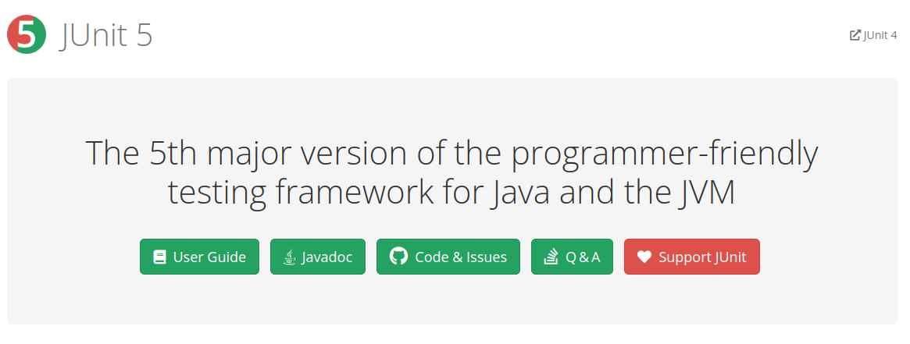

---
https://junit.org/junit5/
___
```xml
<dependency>
    <groupId>org.junit.jupiter</groupId>
    <artifactId>junit-jupiter-api</artifactId>
    <version>${junit5.version}</version>
</dependency>
```
---
### Software defects
- **Error**: A human action that produces an incorrect result. Errors can be classified into two categories:
1. Syntax error (program statement that violates one or more rules of the language in which it is written).
2. Logic error (incorrect data fields, out-of-range terms, or invalid combinations)
- **Fault**: The manifestation of an error in the software system is known as a fault. For example, an incorrect step, 
process, or data definition.
- **Failure**: The inability of the software system to perform its required functions is known as (system) failure.
---

### Testing levels

- **Unit testing**: Here, individual program units are tested. Unit testing should focus on the functionality of objects or methods
- **Integration testing**: Here, units are combined to create composite components. Integration testing should focus on testing components, interfaces.
- **System testing**: Here, all of the components are integrated and the system is tested as a whole.
- **Acceptance testing**: Here, consumers decide whether or not the system is ready to be deployed in the consumer environment. It can be seen as high-level functional testing performed at system level by final users or customers.
---

### Black-box testing

**Black-box testing** (also known as **functional** or **behavioral** testing) is based on requirements with no knowledge
of the internal program structure that is being tested to derive test cases.
 - Systematic testing
 - Random testing
 - Graphic User Interface testing
 - Model-based testing (MBT)
 - Smoke testing
 - Sanity testing