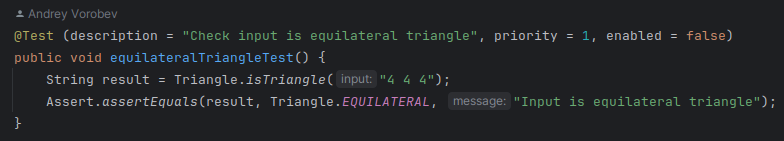
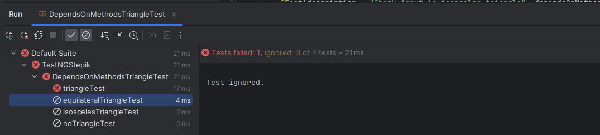
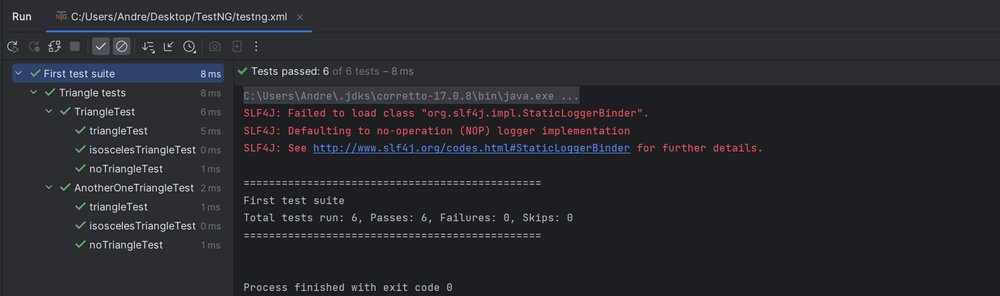
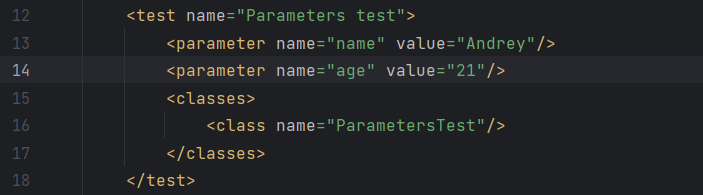
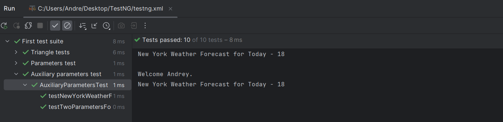
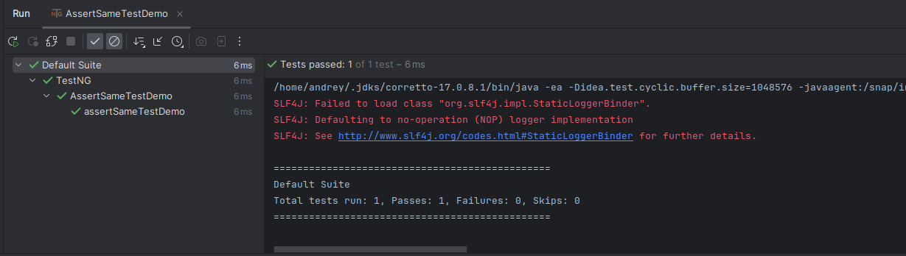
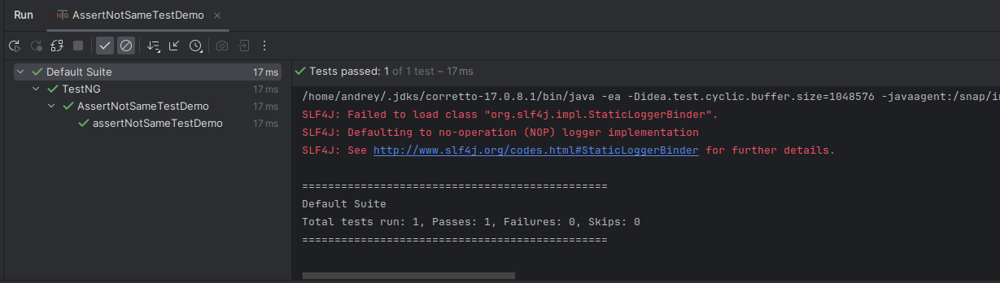

### В проекте используется: ###


#### Библиотеки: ####


###### Используется материал
1. [Константин Барзаковский](https://qaway.ru/);
2. [Документация TestNG](https://testng.org/doc/documentation-main.html);
3. [Stepik](https://stepik.org).

---
**TestNG** - это тестовый фреймворк, предназначенный как для unit, так и для интеграционных и end-to-end тестов. 
Основная работа строится через использование различных аннотаций. Имеется возможность гибкой конфигурации и многопоточного запуска автотестов.

В TestNG можно использовать data-driven подход, с помощью провайдеров данных @DataProviders, а также 
параметризовать свои тесты. Популярные среды разработки, такие как Eclipse и Idea имеют плагины для работы с TestNG.

Создание простого теста в testng состоит из нескольких шагов. Сначала мы описываем бизнес логику теста. 
Затем добавляем в нее аннотации testng. Следующим шагом нам необходимо добавить конфигурацию нашего теста в файл testng.xml. Теперь у нас всё готово для запуска теста.

---
## Аннотация @Test

Аннотация `@Test` содержит большое количество полей для дополнительных настроек.

- `description` мы можем добавить описание для нашего теста;
- `priority` указывается очередность выполнения тестового метода, Чем меньше значение, тем раньше он будет выполнен. 
Значение по умолчанию 0;
- `enabled` мы можем отключить выполнение тестового метода или класса, указав значение false. По умолчанию enabled имеет значение true.

Более подробное описание с примерами `/src/test/java/TriangleTest` 

### @Test Основные атрибуты 

- `groups` указываются названия групп, в которые наш метод или класс будут входить. 
Это может потребоваться для группировки при запуске тестов или указании зависимостей запусков.
- `dependsOnGroups` и `dependsOnMethods` нужны для создания зависимостей. В dependsOnMethods мы можем указать 
имя другого тестового метода. Если выполнения этого теста завершилось неудачно, текущий тестовый метод не будет 
выполнен.

- `alwaysRun` по умолчанию имеет значение false. Если установить его в true, тестовый метод будет выполнен 
независимо от результата других тестов.

Более подробное описание с примерами `/src/test/java/DependsOnMethodsTriangleTest`

---

## Конфигурация TestNG - testng.xml

С его помощью мы можем настраивать тестовые прогоны, устанавливать зависимости между тестами, устанавливать приоритеты 
запуска тестов. Также можно включать или исключать классы, тестовые методы, пакеты и другие сущности.

### Основные теги
- `<suite>` представляет собой весь xml файл и содержит набор тестов;
- `<test>` содержит один или несколько тестовых классов;


- `<class>` содержит один или несколько тестовых методов.

---

## Параметризация 

Большинство тестов будут отличаться только входными параметрами, для этого в TestNG есть 
параметризованные тесты. В лице аннотации `@Parameters`. 

Для примера напишем небольшой тест, принимающий в качестве параметра:
1. Имя типа String 2. Возраст типа Integer.

Так как, сами значения и имена хранятся в `testng.xml`,



`@Parameters`же содержит **только имена этих значений**.

Отмечу одну особенность, если попытаться запустить тест из тестового класса, то он 
завершиться ошибкой:


Их необходимо запускать напрямую из файла `testng.xml`. Область видимости напрямую зависит, от 
расположения тега `<parameter>`. В нашем примере, данный тег прописан на уровне тега 
`<test>`


Рассмотрим небольшой пример в соответствии файла `testng.xml`
```java
@Parametrs({"Name", "Age"})
@Test
public void testTwoParemetrs(String name, int age){
    // Бизнес логика теста
}
```

Расширим область видимости на два тестовых класса, для этого создадим ещё один класс
`AuxiliaryParametersTest`, а в `testng.xml` переместим тег содержащий значение `Name` в корень тега 
`<suite>`
<details>
    <summary>testng.xml</summary>

```
<?xml version="1.0" encoding="UTF-8"?>
<!DOCTYPE suite SYSTEM "http://testng.org/testng-1.0.dtd">
<suite name="First test suite">

    <parameter name="Name" value="Andrey"/>

    <test name="Triangle tests">
        <classes>
            <class name="TriangleTest"/>
            <!--В следствии добавления нового класса, будут запущены все тесты, в данном случае 6-->
            <class name="AnotherOneTriangleTest"/>
        </classes>
    </test>

    <test name="Parameters test">
        <parameter name="Age" value="21"/>
        <classes>
            <class name="ParametersTest"/>
        </classes>
    </test>

    <test name="Auxiliary parameters test">
        <parameter name="Temperature" value="18"/>
        <classes>
            <class name="AuxiliaryParametersTest"/>
        </classes>
    </test>
</suite>
```
</details>

В данном случае нас не интересует логика тестов, первый метод будет показывать температуру на сегодня, а второй 
сделает это персонально для нас, используя имя. В конечном итоге получаем следующие:



Подробнее и с примерами можно посмотреть по этому пути: `src/test/java/ParametersTest.java`

---
## Провайдер данных, @DataProvider

При проведении тестирования, не редко, требуется запускать один и тотже 
тест с различными данными. Тут на помощь приходит `@DataProvider` который 
будет содержать все нужные комбинации данных. Для этого всего лишь, достаточно 
в `@Test` передать атрибут `dataProvider = "____"`.
```java
@Test(dataProvider = "dataProvider")
public void test(String one, int two){
    //
}

@DataProvider(name = "dataProvider")
// Если опустить атрибут name будут использовано имя метода 
public Object[][] dataProvider() {
        return new Object[][]{
            {"one", 1},
            {"two", 2},
            {"three", 3},
        };
}
```
TestNG запустит 3 теста с разными данными.

Подробнее и с примерами можно посмотреть по этому пути: src/test/java/DataProviderTest.java

---
## @BeforeXXX, @AfterXXX дополнительная логика 
Если у вас появится необходимость добавить дополнительную логику
перед\после тестов, можете воспользоваться следующими аннотациями

| _Аннотация_    | _Область действия_                                                                                             |
|---------------|----------------------------------------------------------------------------------------------------------------|
|          |
| `@BeforeSuite` | будет запущен перед запуском первого тестового метода в текущем тестовом наборе, определенном в тэге `<suite>` |
| `@BeforeTest` | запустится перед запуском первого тестового метода в текущем тесте, определенном в тэге `<test>`               |
| `@BeforeClass` | запустится перед запуском первого теста в текущем тестовом классе                                              |
| `@BeforeMethod` | будет запущен перед каждым тестом в данном классе                                                              |
|               |
| `@AfterSuite`  | запустится после запуска всех тестов в текущем тестовом наборе, определенных в тэге `<suite>`                                                                                                               |
| `@AfterTest`   | будет запущен после запуска всех тестов в текущем тесте, определенных в тэге `<test>`                                                                                                               |
| `@AfterClass`  | будет запущен после текущего тестового класса                                                                                                               |
| `@AfterMethod` | запустится после каждого теста в данном классе                                                                 |

Разбирать все аннотации, не считаю целесообразным, принцип думаю понятен.
Для примера создадим ещё два тестовых класса `before.after.xxx.FirstTest` и `before.after.xxx.SecondTest`.
В них реализуем простую логику (по три тестовых метода в каждом), вывод информативного сообщения. С именем класса и вызываемого метода.

```java
public class FirstTest extends BaseTest{

    @Test
    public void firstExampleMethodTest() {
        System.out.println("\t|\t|\t|\tClass name - " + getClass().getSimpleName() + " - firstExampleMethodTest ");
    }

    @Test
    public void secondExampleMethodTest() {
        System.out.println("\t|\t|\t|\tClass name - " + getClass().getSimpleName() + " - secondExampleMethodTest ");
    }

    @Test
    public void thirdExampleMethodTest(){
        System.out.println("\t|\t|\t|\tClass name - " + getClass().getSimpleName() + " - thirdExampleMethodTest ");
    }
}
```
Запускаем наш конфигурационный xml файл получаем:
<details>
    <summary>Результат работы testng.xml</summary>

```text
Class - SecondTest -> @BeforeSuite 

	Class - FirstTest -> @BeforeTest 
	|	Class - FirstTest -> @BeforeClass 
	|	|	Class - FirstTest -> @BeforeMethod 
	|	|	|	Class name - FirstTest - firstExampleMethodTest 
	|	|	Class - FirstTest -> @AfterMethod 
	|	|	Class - FirstTest -> @BeforeMethod 
	|	|	|	Class name - FirstTest - secondExampleMethodTest 
	|	|	Class - FirstTest -> @AfterMethod 
	|	|	Class - FirstTest -> @BeforeMethod 
	|	|	|	Class name - FirstTest - thirdExampleMethodTest 
	|	|	Class - FirstTest -> @AfterMethod 
	|	Class - FirstTest -> @AfterClass 
	Class - FirstTest -> @AfterTest 

	Class - SecondTest -> @BeforeTest 
	|	Class - SecondTest -> @BeforeClass 
	|	|	Class - SecondTest -> @BeforeMethod 
	|	|	|	Class name - SecondTest - firstExampleMethodTest 
	|	|	Class - SecondTest -> @AfterMethod 
	|	|	Class - SecondTest -> @BeforeMethod 
	|	|	|	Class name - SecondTest - secondExampleMethodTest 
	|	|	Class - SecondTest -> @AfterMethod 
	|	|	Class - SecondTest -> @BeforeMethod 
	|	|	|	Class name - SecondTest - thirdExampleMethodTest 
	|	|	Class - SecondTest -> @AfterMethod 
	|	Class - SecondTest -> @AfterClass 
	Class - SecondTest -> @AfterTest

Class - SecondTest -> @AfterSuite
```
</details>

Подробнее и с примерами можно посмотреть по этому пути: src/test/java/before/after/xxx

---
## @BeforeGroups, @AfterGroups дополнительная логика для группы тестов

Ещё один плюс в копилку атрибуту `groups = {"name"}`. В таблице приведено две аннотации и подробное описание: 

| _Аннотация_    | _Область действия_                                                                    |
|---------------|---------------------------------------------------------------------------------------|
| `@BeforeGroups` | будет запущена **перед** всеми тестовыми классами/методами относящихся к одной группе |
| `@AfterGroups` | будет запущена **после** всех тестовых классов/методов относящихся к одной группе     |

С помощью данных аннотаций мы можем динамически настраивать тесты, обобщая в группы тестовые методы/классы и приметить к 
ним определенную логику заложенную в `@BeforeGroups` и `@AfterGroups`.


---
## Класс Assert 
Содержит методы, которые помогут нам, что-нибудь сравнить или проверить 
### 1. assertEquals(actual, expected, message)

`assertEquals(actual, expected);` метод сравнивает два значения, возвращает `true` если они равны:
```java
@Test
public void trueTest(){
    byte a = 10;
    assertEquals(a, 10); // вернёт true 
}
```
и `false`, если значения не равны:
```java
@Test
public void falseTest(){
    byte a = 7;
    assertEquals(a, 10); // вернёт false 
}
```
Также мы можем передать ешё один параметр, это `message` `assertEquals(actual, expected, message);`, он необходим если мы хотим получить информативное сообщение
об ошибке `false`

```java
assertEquals(10, 107, "10 != 107");
```

### 2. assertNotEquals(actual, expected, message)

Здесь всё аналогично `assertEquals()` только теперь мы проверяем, тто наше условие ложно и ожидаем 
`true`, а если они вдруг равны то метод вернёт `fslse`.
```java
@Test
public void trueTest(){
    byte a = 7;
    assertNotEquals(a, 10); // вернёт true
}
```

### 3. assertTrue() и assertFalse()
В TestNG есть два метода для проверки булевых значений, первый `assertTrue()` когда мы ожидаем `true` и второй
`assertFalse()` если мы ждём `fasle`.

Аргументами методу передаются: логическое условие `condition` и сообщение `message` которое мы увидим в случае ошибки:
```java
asserTrue(condition, message);
asserFalse(condition, message);
```
Ниже приведен пример простой реализации данных тестовых методов
```java
@Test
public class TestBoolean{
    
    public void testAssertTrue(){
        boolean condition = (10 == 10);
        assertTrue(condition); //вернёт true
    }
    
    public void testAssertFalse(){
        boolean condition = (10 == 1);
        assertFalse(condition); //вернёт true
    }
}
```

### 4. assertNull() и assertNotNull()

Аргументами методу передаются: **объект** `object`, который мы будем проверять на `Null` и **сообщение** `message`
которое мы увидим в случае ошибки:
```java
asserNull(object, message);
asserNotNull(object, message);
```

### 5. assertSame() и assertNotSame()

Эти методы очень схожи с `assertEquals`, только в данном случае мы сравниваем не сами значения объектов, а их ссылки.
Аргументами методу передаются: **фактическое значение** `actual`, **ожидаемое значение** `expected` и **сообщение** `message` 
которое мы увидим в случае ошибки:
```java
asserSame(actual, expected, message);
asserNotSame(actual, expected, message);
```
Ниже реализуем тестовый метод, в котором создадим объект типа `String` и присвоим ссылку на объект переменной `expected`,
и проверим, действительно ли ссылки равны?

```java
import org.testng.annotations.Test;

import static org.testng.AssertJUnit.assertSame;

public class AssertSameTestDemo{

    @Test(description = "assertSame() demo")
    public void assertSameTestDemo(){
        final String actual = new String("Hello world!");
        final String expected = actual;

        assertSame(actual, expected); // вернёт true
    }
}
```



Аналогично проверим метод `assrtNotSame()`, только теперь создадим два разных объекта.

```java
import org.testng.annotations.Test;

import static org.testng.AssertJUnit.assertNotSame;

public class AssertNotSameTestDemo {
    @Test(description = "assertNotSame() demo")
    public void assertNotSameTestDemo() {
        final String actual = new String("Hello world!");
        final String expected = new String("Hello world!");

        assertNotSame(actual, expected); // вернёт true
    }
}
```


---
